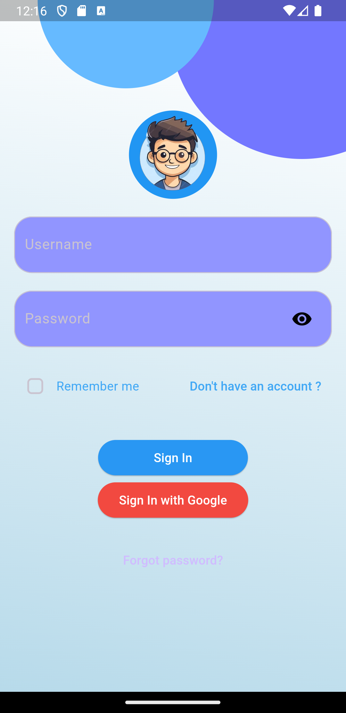

# ✨ CV Presentation in Flutter ✨

This **Flutter application** presents my CV with a sleek and modern design. It incorporates a **Dark Mode** and **Light Mode**, allowing users to switch seamlessly between the two, providing an optimal viewing experience in any environment.

## 🌟 Key Features

- **🌗 Dark & Light Mode**  
  Toggle between dark and light themes for an adaptable viewing experience. Perfect for different lighting conditions!

- **📱 Responsive Design**  
  The layout adjusts beautifully across all devices—mobile, tablet, and desktop—offering a consistent and polished appearance.

- **🎨 Modern UI**  
  The design is clean and professional, featuring sections for:
  - Personal Information
  - Education
  - Skills
  - Projects
  - Experience

## 🚀 Technologies Used

- **Flutter**: For cross-platform development

## 🖼️ App UI

